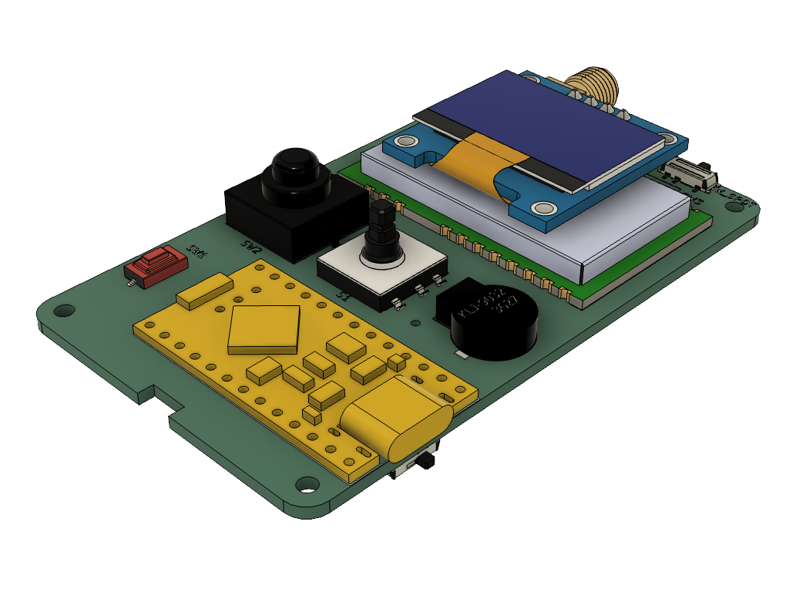
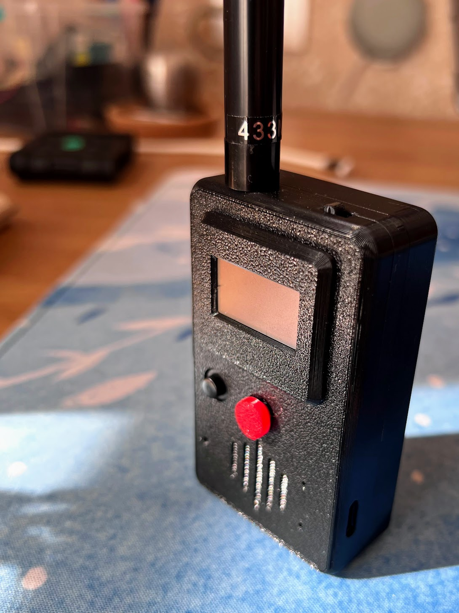

# MeshJoy

*🇺🇦 Ukrainian / Українська версія](README.uk.md).*

A portable **Meshtastic / Meshcore** radio device with up to **1 W LoRa** output power and **3–4 days** of battery life.

Built for hikers, radio amateurs, and anyone who needs communication without the internet.

> Status: v0.2.2 assembled and tested.

## Features

- **Joystick + OLED screen** — convenient menu navigation via a 4-way joystick with push-to-select.
- **Physical power button** — combined mechanical/electronic power control.
- **GPS switch** — GPS can be fully disabled in software *or* with a hardware switch on the case.
- **GPS navigation** (optional) — Ebyte E108-GN02D receiver reports coordinates at configurable intervals to the public Meshtastic network or only to selected contacts. The receiver sleeps between intervals to save power.
- **Buzzer** — sound notifier pre-installed on the board.
- **Expandable** — optional vibration motor; accessible reset button and visible status LEDs without opening the case.
- **Built-in charger** — charging managed by the microcontroller; over-discharge protection via the battery BMS.

## Battery options

| Battery | Capacity | GPS |
|---|---|---|
| LiPo 103450 | 2000 mAh | Yes |
| Li-Ion 18650 | 3400 mAh | Yes |
| Li-Ion 18650 ×2 | 6800 mAh | No |

## Specifications

| | |
|---|---|
| LoRa radio | Ebyte E22-400M30S, 1 W |
| Microcontroller | ProMicro nRF52840 |
| GPS | Yes (optional) |
| Bluetooth | Yes (~2 m range) |
| Wi-Fi | No |
| Battery | 2000 mAh (2400–6800 mAh) |
| Charge current | ~300 mA |
| Battery life | 3–4 days (no GPS, 2 Ah battery) |
| Charge time | ~7 hours (2 Ah battery) |
| Water resistance | None |
| Size | 49 × 96 × 27 mm (W × H × D) |

## Technical notes

- **Processor:** nRF52840 (ProMicro / SuperMini clone) — low-power, Bluetooth, no Wi-Fi. Built-in LiPo charge controller and 2 LEDs. Reset button broken out on the main board.
- **LoRa:** Ebyte E22-400M30S, 1 W @ 433 MHz. At 5 V it reliably delivers 1–1.2 W.
- **Antenna connector:** SMA female mounted parallel to the board surface — easier to solder and to fit in a small case.
- **Power:** Runs from a 1S (3.7 V) battery or USB-C. An XL6380 boost converter supplies 5 V for the LoRa module. Peak draw during transmit is up to ~1.5 A; average consumption with a test transmission every 5 min was ~65 mW.
- **Power switch:** Combined mechanical/electronic — a physical button drives a MOSFET that switches battery current (a plain micro-switch can't handle the ~1.5 A peak).
- **Joystick:** 4 positions + press; soldered as SMD. The device name comes from "Mesh" + "joystick".
- **Screen:** Standard 0.96" OLED (GND-VCC pinout).
- **External device control:** 2 power MOSFETs switch ground — one for the buzzer, one broken out for a vibration motor or GPS control. A slide switch also cuts +5 V for low-power peripherals (e.g. fully powering off GPS).
- **Board:** Custom-designed, using the standard `nrf52_promicro_diy_tcxo` Meshtastic pinout.

## Enclosure

The case was designed from scratch in Fusion 360 and will be **free to download and modify**. It is optimized for fast, support-free 3D printing (PETG). The screen bezel snaps into the top cover without glue; halves are joined with M2 screws (no nuts) and the board is held by integrated standoffs. Mounting for the GPS module is included.

## Links

- Website: https://meshjoy.com.ua/
- Technical details: https://meshjoy.com.ua/technical-details/
- Contact the author / Telegram discussion group (see website)

## License

These materials are licensed under [CC BY-NC-SA 4.0](https://creativecommons.org/licenses/by-nc-sa/4.0/) (Attribution — NonCommercial — ShareAlike).
